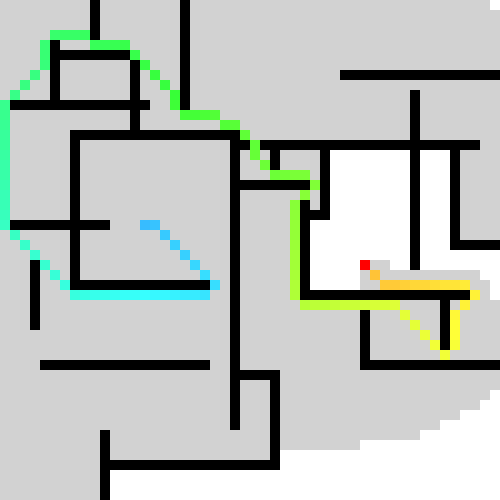

# Astar
A* pathfinding algorithm (a.k.a. A* search algorithm) written in C++

This is an widely used pathfinding and searching algorithm; learn more about A* at [Wikipedia](https://en.wikipedia.org/wiki/A*_search_algorithm).

This implementation is heavily based on Makito Sumi's version found here: [Makito Sumi's A-star](https://github.com/SumiMakito/A-star). I have changed a lot of the structure in the code and implemented Astar as a class. Furthermore, I have fixed some problems with the scaling of the heuristic function and added AMITS tie-breaker as an option, see: [breaking-ties](http://theory.stanford.edu/~amitp/GameProgramming/Heuristics.html#breaking-ties). Furthermore, an option for including an obstacle repulsive potential into the cost function has been implemented: As nodes are expanded the distance to the nearest obstacle is computed and based on this distance the cost function is modified. 

This is going to be used in a Laser Scanner obstacle avoidance code that I'm currently working on so the code might be prone to big changes.

OpenCV is not necessarily required, provided that you have found another way to convert input images into arrays which have the same format used in the example. The Astar class can compile without OpenCV installed as it is only used for visualisation.

### Map samples

[Map 50px 1](assets/Map50_0.bmp) | [Map 50px 1](assets/Map50_1.bmp) | [Map 50px 2](assets/Map50_2.bmp) | [Map 50px 3](assets/Map50_3.bmp)
------------ | ------------- | ------------- | ------------- 
 |  |  | 

### Previews

> **DO NOT** use images below as input images, they have been scaled up for better visual effect. 

> Astar with diagonal movement and diagonal heuristic:

Input | Output
------------ | -------------
 | 
 | 
 | 
 | 

> Astar with diagonal movement and heuristic and a strong obstacle repulsive potential:

Input | Output
------------ | -------------
 | 
 | 
 | 
 | 


### License
Beloved **MIT**

```
MIT License

Copyright (c) 2018 Hjalte Bested Møller
Copyright (c) 2017 Makito Sumi

Permission is hereby granted, free of charge, to any person obtaining a copy
of this software and associated documentation files (the "Software"), to deal
in the Software without restriction, including without limitation the rights
to use, copy, modify, merge, publish, distribute, sublicense, and/or sell
copies of the Software, and to permit persons to whom the Software is
furnished to do so, subject to the following conditions:

The above copyright notice and this permission notice shall be included in all
copies or substantial portions of the Software.

THE SOFTWARE IS PROVIDED "AS IS", WITHOUT WARRANTY OF ANY KIND, EXPRESS OR
IMPLIED, INCLUDING BUT NOT LIMITED TO THE WARRANTIES OF MERCHANTABILITY,
FITNESS FOR A PARTICULAR PURPOSE AND NONINFRINGEMENT. IN NO EVENT SHALL THE
AUTHORS OR COPYRIGHT HOLDERS BE LIABLE FOR ANY CLAIM, DAMAGES OR OTHER
LIABILITY, WHETHER IN AN ACTION OF CONTRACT, TORT OR OTHERWISE, ARISING FROM,
OUT OF OR IN CONNECTION WITH THE SOFTWARE OR THE USE OR OTHER DEALINGS IN THE
SOFTWARE.
```